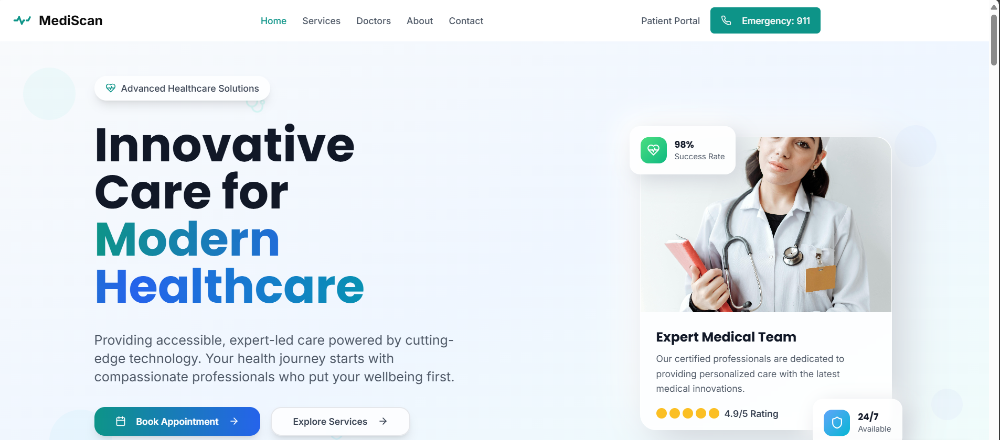

# 🏥 MediScan – Hospital Web App Interface

MediScan is a modern, responsive hospital web app interface focused on delivering seamless user experiences for patients and healthcare providers. Built with clean HTML/CSS (optionally Tailwind or React), the design emphasizes clarity, accessibility, and ease of use.

---

##  Features

- 🧭 Clean and intuitive navigation bar (Home, Services, Doctors, About, Contact)
- 🆘 One-click Emergency 911 button
- 👨‍⚕️ Patient Portal access
- 🖥️ Responsive design for all screen sizes
- 🎯 Hero section with mission-driven message and CTAs
- 🎨 Neumorphic UI elements and soft gradients for a modern healthcare look

---

## 💡 Tech Stack

- HTML5
- CSS3
- [Optional] Tailwind CSS
- [Optional] React.js

---

## 📸 Screenshots

---

---

## 📲 Live Demo

[🔗 View Live](https://v0-hospital-app-design-xi.vercel.app/)

---

## 📌 How to Use

1. Clone the repository  
   `git clone https://github.com/yourusername/mediscan.git`
2. Open `index.html` in your browser  
3. Customize content or integrate backend as needed

---

## ✨ Project Purpose

This project is designed to showcase frontend skills and UI/UX design for a hospital or healthcare-related web platform. It's ideal for resumes, freelance portfolios, or demo projects in interviews.

---

## 📄 License

This project is open-source and available under the [MIT License](LICENSE).

---

## 🙌 Acknowledgments

- Inspired by modern hospital UX trends
- UI references from Dribbble & Figma design kits

---

## 📧 Contact

For feedback or collaborations:  
**Your Name** – [your.email@example.com](mailto:rakesh1719@gmail.com)  
[LinkedIn](https://www.linkedin.com/in/rakesh-g-261666350/) | [Portfolio](https://v0-rakesh-dev-portfolio-website-roan.vercel.app/)

